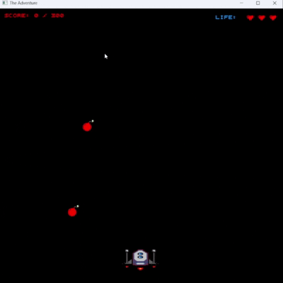

# The Adventure

## Description

The Adventure is a simple 2D arcade-style catch game built in C# on top of the ProjectSkeleton starter repository.

The player controls a spaceship at the bottom of the screen. The goal is to collect the good falling items, avoid the bad falling items, and survive for as long as possible. The game tracks score, lives, level progression, and a saved high score between runs.

The game is built without a game engine. It uses SDL through Silk.NET for window creation, input handling, rendering, and the main game loop.

---

## Gameplay

The player moves left and right to catch falling items.

- Green/good items increase the score.
- Red/bad items remove one life.
- Missing a good item also removes one life.
- The game gets harder as the score increases.
- The high score is saved to disk and loaded again when the game starts.

The target score is **300 points**.

If the player reaches at least 300 points before losing all lives, the final state is a win. If the player loses all lives before reaching 300 points, the final state is a loss.

---

## Controls

| Key | Action |
| --- | --- |
| Left Arrow | Move player left |
| Right Arrow | Move player right |
| R | Restart after game over |
| X | Quit after game over |

---

## Project Structure

| File | Purpose |
|------|----------|
| `Program.cs` | Application entry point and main game loop |
| `CatchGame.cs` | Core game logic, score system, lives, levels, and win/lose conditions |
| `GameRenderer.cs` | Rendering of sprites, HUD, custom text, and game-over screen |
| `Player.cs` | Player entity and movement logic |
| `FallingItem.cs` | Falling collectible and obstacle entities |
| `CollisionHelper.cs` | Collision detection logic |
| `HighScoreStore.cs` | High-score persistence between runs |
| `Sprite.cs` | PNG sprite loading and rendering |
| `GameExceptions.cs` | Custom exception type |

---

## Technologies Used

- C#
- .NET 10
- Silk.NET
- SDL2
- StbImageSharp

---

## Gameplay GIF



---

## AI Usage Summary

ChatGPT (GPT-5.5 Thinking) was used as a coding assistant. More information are available on `AI_USAGE.md`.

---

## Build and Run

### Requirements

- .NET 10 SDK, running on Windows 11.

### Build

```bash
dotnet build
